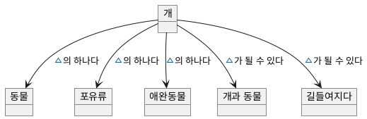
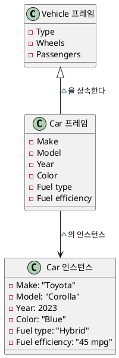

# Ch3. 지능형 에이전트의 필수 구성 요소
(Essential Components of Intelligent Agents)
- Intelligent agent는 이론적 기반을 제공
- AI agent는 LLM 강화된 실무 구현으로 실세계 자동화를 강조

## 1. 지능형 에이전트에서의 지식 표현
형식적으로 데이터를 구조화 및 조직화하는 방식.

다음은 지식 표현 방식들중 세 가지이다.
### 의미망 semantic network
- node, edge로 구성된 그래프 기반 구조
- ex: dog(node) is a(edge) animal(node)
- 속성 상속을 통해 일반화할 수 있는 장점(개는 동물의 하위 클래스다. 동물은 호흡한다. 따라서 개는 호흡한다.)
- **일차 논리** 같은 연역적 방법과도 잘 맞는다.
- 일차 논리(first order logic)?
    - “어떤 대상 x가 존재한다/모든 대상 x에 대해 성립한다”같은 문장을 수학적으로 쓸 수 있게 해 줌
    - 일차 논리는 지식 표현, 자동 추론, 의미망 같은 걸 “기계가 다룰 수 있는 방식”으로 표현할 때 표준



### 프레임
- 개념과 연관 속성을 프레임이라는 데이터 구조로 모델링하는 방식.
- ex: (개념) Car - (속성) make, model, year, color, fuel type
- 상위 수준의 프레임으로부터 속성 상속 가능 (Vehicle, Car)
- 장점: 절차적 지식(procedural knowledge)도 표현 가능.
    - Car 프레임은 연료 효율을 계산하는 메서드, 정비 기록을 질의하는 메서드 포함 가능
- 현실 세계에서 표현
    - 자연어 처리
    - 전문가 시스템
    - 객체지향 프로그래밍
    - 컴퓨터 비전
    - 로보틱스



### 논리 기반 표현
- 기호 논리를 활용해 도메인에 대한 사실, 규칙, 공리를 인코딩. 앞의 의미망과 프레임이 시각적이었다면 이쪽은 수학적 방식.
- 장점: 형식적 엄밀성, 그로 인한 모든 유효한 결론 도출 가능. 안전을 중시하는 도메인에서 활용하기 좋음.
- ∀x
    - for all x(모든 x에 대해)
    - ∀x(Human(x) -> Mortal(x))
- ∨
    - or(선택)
    - Rain ∨ Sunny
- ◇
    - eventually(언젠가는)
    - ◇Stable
- 사례
    - 전문가 시스템
    - 데이터베이스 시스템
    - 자동 추론
    - 법률 및 규제 도메인
    - 시맨틱 웹
## 2. 지능형 에이전트의 추론
에이전트가 지식을 표현할 수 있는 방식이 준비되면, 추론 메커니즘은 그 지식을 지능적으로 조작하고 활용할 수 있게 해준다.
추론 능력을 활용해 새로운 통찰 도출, 논리적 결론 내림, 관찰한 내용을 설명, 정보에 근거한 의사결정, 목표 달성 등을 해낸다.

### 연역 추론
하향식으로 진행되는 논리 추론 방식
```
모든 인간은 죽는다.
소크라테스는 인간이다.
그로므로 소크라테스는 죽는다.
```
연역 추론은 새로운 지식을 획득할 수는 없지만, 에이전트의 결론이 신뢰할 수 있게 하는 형식적 엄격성을 제공.
활용분야
- 수학/기하학, 법률, 소프트웨어 검증, 네트워크 라우팅
### 귀납 추론
상향식 추론 방식.
```
지난 백만 일 동안 매일 태양이 떠올랐다.
그러므로, 태양은 내일도 떠오를 것이다.
```
관찰된 증거에 기반해 개연성 높은 결론을 내는 것으로, 결론이 논리적으로 보장되지 않음. 따라서 샘플이 불완전할 경우 결론이 틀릴 수 있음.
활용분야
- 과학적 방법, 머신러닝, 패턴 인식, 데이터 마이닝, 자연어 습득
- 지식이 완전히 주어지지 않은 상태, 불확실하고 잡음이 많은 환경, 완전하지 않은 지식으로부터 지식을 추출할 때 필요
### 가설 추론
역방향 추론.
주어친 현상이나 데이터를 보고
기존 지식을 기반해 가장 그럴듯한 원인, 전제를 찾아냄.
```
잔디가 젖어 있다.
그럴듯한 설명: 어젯밤에 비가 왔다.
```
활용분야
- 의료 진단, 결함 탐지, 포렌식/범죄 수사, AI 계획, 과학적 발견
- 틀에 얽메이지 않는 사고 가능. 창의적.
- 그래서 일반적으로 연역 추론과 함께 사용해 가설의 일관성과 개연성을 검증함
- 그러나 구현이 어려움. 여러 가설 생성/평가에 드는 계산 비용이 매우 크고 복잡.
## 3. 적응형 에이전트를 위한 학습 메커니즘
지능형 에이전트은 학습 메커니즘을 통해 환경 변화에 적응하거나 개선된다.
### 지도학습
- 라벨이 붙은 데이터셋으로 에이전트를 훈련시키는 방법
- 목표: 새로운 입력에 대한 출력을 예측하는 매핑 함수를 학습
- 분류, 회귀 작업에 사용됨.
- 활용분야: 이미지 분류, 스팸 탐지, 기계 번역, 의료 진단
### 비지도학습
- 라벨이 붙지 않은 데이터셋으로 에이전트를 훈련시키는 방법
- 목표: 데이터 내에 내재된 패턴, 상관관계, 군집을 발견하는것
- 활용분야: 고객 세분화, 이상 탐지, 주제 모델링, 차원(dimension) 축소
### 강화학습
- 보상, 처벌 형태의 환경 피드백을 이용한 시행착오로 작동
- 에이전트는 다양한 행동을 시도해 보고 관찰된 보상에 따라 전략을 업데이트
- 활용분야: 게임 플레이, 로보틱스, 공급망 최적화, 교통 신호 제어
### 전이학습
- 한 환경에서 학습한 지식을 활용해 다른 유사한 환경에서의 학습을 도움
- 새로운 환경 학습 속도와 효율성 향상
- 활용분야: 자연어 처리, 컴퓨터 비전, 추천 시스템
## 4. 에이전트 시스템에서의 의사결정과 계획
시나리오를 분석하고, 결과를 평가하며, 제약조건에 따라 바람직한 결과로 이어지는 행동을 선택하는 능력.
의사결정에 관여하는 구성요소.
### 유틸리티 함수
- 결과를 유틸리티값에 매핑해 에이전트의 선호를 정량화함. 에이전트는 기대 유틸리티가 최대화된 행동을 선택.
- ex: 선택에 영향을 주는 요소를 가중치를 부여해 수치화한 다음 합산해 return.
- 도메인에 따라 다양한 수학적 형태를 지님
    - 속성 간의 선호 차이를 수치화하는 **가중치** 기반 단순 점수 함수
    - 모든 제약 조건을 충족할때 최대화 되는 **제약** 충족 함수
    - 가격, 이익, 비용 등을 모델링하는 **경제학적** 유틸리티 함수
    - 독립적인 결과 속성들에 대한 선호를 **곱셈으로 결합**하는 함수
    - 다중 속성 간 트레이드오프(multi-attribute tradeoff)
- 에이전트의 모든 선호를 반영하는 유틸리티 함수 정의는 어렵다.
- 따라서 선호 추출, 역강화 학습, 인간 피드백 기반 학습 기법들을 활용 가능하다.
### 계획 알고리즘
목표 달성을 위해 에이전트가 수행해야 할 일련의 행동을 도출하는 알고리즘.
- 그래프 기반 계획
    - 계획 문제를 상태 공간 그래프로 표현하고, 상태를 노드, 행동/전이를 엣지로 두고 경로 탐색으로 계획을 찾는다.
    - DFS·BFS·다익스트라·A* 등 그래프 탐색/최적 경로 탐색 알고리즘을 사용해 목표 상태로 가는 행동 순서를 구하지만, 상태 수가 커지면 그래프 전체를 미리 표현해야 해서 확장성이 떨어진다.
- 휴리스틱 탐색
    - 완전한 탐색 대신, 휴리스틱 함수로 “목표와 얼마나 가까운지”를 추정해 유망한 경로를 먼저 탐색하는 방식이다.
    - 최적해 보장은 일부 포기하지만, 잘 설계된 휴리스틱을 쓰면 거대한 상태 공간에서도 실용적인 시간 안에 근사 해를 찾을 수 있어 실제 게임 AI 등에서 많이 쓴다.
- 몬테카를로 트리 탐색
    - 현재 상태에서 가능한 행동들을 시뮬레이션으로 여러 번 임의 탐색하여 비대칭적으로 트리를 성장시키고, 많이/좋게 평가된 분기 쪽으로 탐색을 집중한다.
    - 불확실성과 거대한 상태 공간에서도 점진적으로 합리적인 결과를 낼 수 있고, 언제든 중간에 멈춰도 현재까지의 추론 결과를 사용할 수 있어 게임·복잡한 의사결정에 적합하다.
- 계층적 계획
    - 복잡한 문제를 상위 목표와 하위 목표(하위 작업)로 계층적으로 나눠 계획하는 방식으로, 각 수준에서 부분 계획을 세운다.
    - 전체 문제를 한 번에 다루지 않고 추상화 수준을 나눠 계산 효율성을 높이며, 인간이 문제를 분해해 생각하는 방식과도 잘 맞는다.
- 제약 만족
    - “만족해야 할 제약 조건들의 집합”으로 문제를 정식화하고, 변수와 가능한 값들의 조합 중 제약을 모두 만족하는 해를 찾는 방식이다.
    - 문제 표현과 해법을 분리할 수 있어 다양한 알고리즘을 적용하기 쉽고, 퍼즐·스케줄링·구성 설계 등 제약이 많은 실제 문제를 자연스럽게 모델링할 수 있다.

## 5. 생성형 AI를 활용한 에이전트 능력 향상
이 단락에서는 생성형 AI 도입으로 지능형 에이전트 분야의 주요 발전 내용을 설명한다.

활용 사례
- 데이터 증강
    - 생성 모델을 사용해 합성 학습 데이터를 생성함으로서 데이터셋을 보완
- 콘텍스트 이해
    - 현실 세계를 모델링한 시뮬레이션으로 에이전트가 콘텍스트를 이해할 수 있게 함.
- 자연어 처리
    - 생성형 언어 모델로 인간-에이전트 간 상호작용
- 창의적 문제 해결
    - 다양한 가능성이 있는 해를 생성함
      고급 기능 활용 사례
- 학습
- 지식 표현
- 의사결정 프로세스
- 생성형 모델
- 피드백 루프

### 에이전틱 AI 구축 시작하기
https://github.com/moseskim/Building-Agentic-AI-Systems/blob/main/Chapter03/Chapter_03.ipynb
